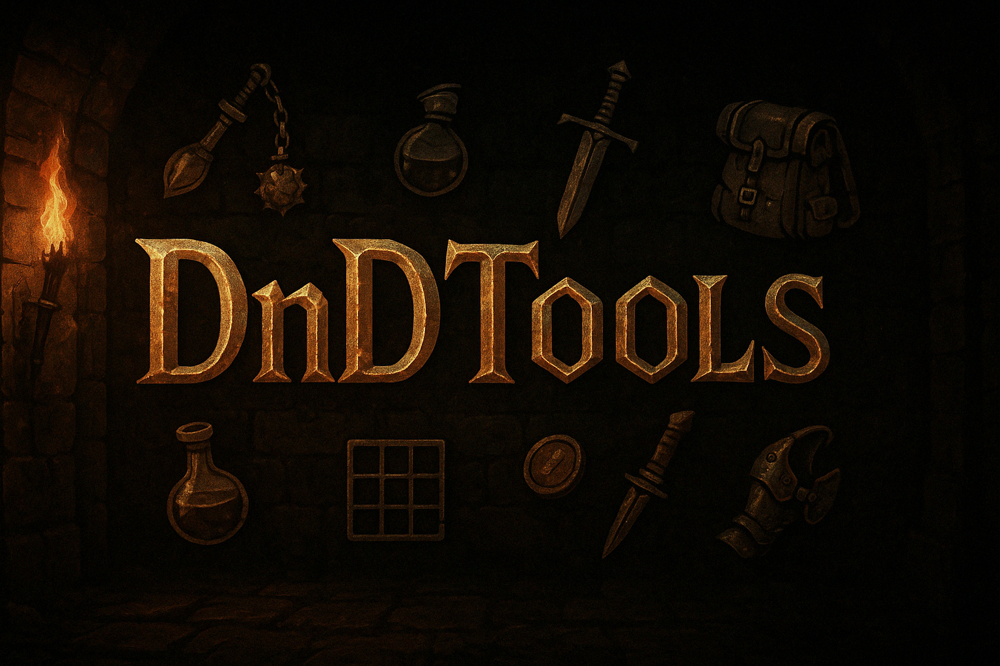

# Dark and Darker Tools
<p align="center">
  
</p>

## 🎮 Demo

<p align="center">
  <video src="https://github.com/user-attachments/assets/ce137f5c-c787-480c-bdac-3c7ebd408979" controls autoplay loop muted width="100%"></video>
</p>

<p align="center">
  
  
  
</p>


A tool to capture and generate visual previews of Dark and Darker stash contents and organize them.

## ⚠️ Disclaimer

This project is not affiliated with, endorsed by, or connected to IRONMACE Co., Ltd. or Dark and Darker in any way. This is a fan-made tool for educational purposes only.

All game content and materials are trademarks and copyrights of IRONMACE Co., Ltd. or its licensors. All rights reserved.

## 🚀 Features

- Real-time data capture
- Visual stash preview generation
- Item name matching and caching
- Grid-based inventory visualization

## 📋 Requirements

- Python 3.7+

## 🔧 Installation

1. Install required dependencies:
```bash
pip install -r requirements.txt
```
## 📖 Usage

1. Start Dark and Darker
2. Run the capture script:
```bash
cd UI
python app.py
```
1. Select the character you want to capture.
2. Open your stash in-game.

## ⚙️ Configuration
### Updating Protobuf Files After a Game Update

After a **Dark and Darker** update, you will need to run:
```
UI\networking\extract.bat
```
to grab the fresh `.proto` files from the game binary.

> **Important:**  
> Before running, update the path inside `extract.bat` if your game is installed somewhere other than the default.  
> The default path is:
> ```
> C:\Program Files\IRONMACE\Dark and Darker\DungeonCrawler\Binaries\Win64\DungeonCrawler.exe
> ```

We will try to keep the `.proto` files in the repository updated, but if they are outdated, you can use this script to generate the latest ones yourself.


## 🛡️ Legal

This project:
- Does not modify any game files
- Does not interact with the game process
- Only captures and analyzes network traffic
- Is provided "AS IS" without warranty of any kind

## 🤝 Contributing

Contributions are welcome! Please feel free to submit a Pull Request.

## 🙏 Acknowledgments
thanks to:
- **Kokkor** on Discord for their help with protobuf and packet capture.
- **Anders** on Discord for their help with this project and for allowing me to use a custom YOLOv5 model.
- [Darkerdb](https://darkerdb.com/) for the amazing api.

## 📄 License

This project is licensed under the MIT License - see the LICENSE file for details.

## 💬 Support

For support or questions, please [open an issue](https://github.com/Beelzebub2/darkanddarker-stash-preview/issues) on GitHub.

## 📝 TODO

- Auto updater
- Quest tracking
- More sorting options
- Support for other resolutions

---
*Remember to always comply with Dark and Darker's Terms of Service while using this tool.*
